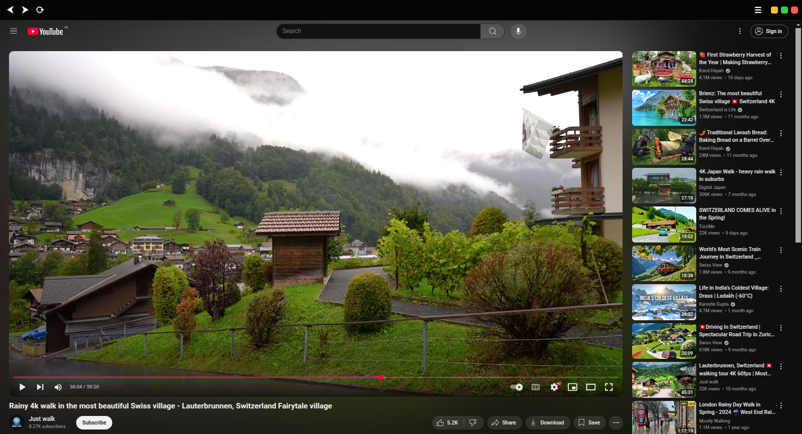

# YouTubeApp

A lightweight YouTube desktop client built with Electron, enhanced with the Ghostery ad blocker and performance tweaks for a distraction-free viewing experience.

> ⚠️ **Disclaimer**: This is a personal project I built for use on my Ubuntu LTS system. It's essentially an Electron wrapper around YouTube with a custom toolbar and a few extra features like ad blocking. I do **not** plan to maintain this project regularly or ensure compatibility across all systems.

---

## ✨ Features

- 🧭 Clean, minimal UI with custom window controls  
- ⚡ Ghostery ad blocking  
- 🚀 Performance-optimized loading  
- 🧹 One-click browsing data cleanup  
- 🎯 Zoom in/out support  
- 🔒 Privacy-focused

---

## 🧰 Tech Stack

- [Electron](https://www.electronjs.org/)  
- [Ghostery Adblocker for Electron](https://github.com/ghostery/adblocker)  
- Vanilla JavaScript, HTML, and CSS

---

## 📦 Packaging

To build the `.deb` package for Ubuntu Linux:

npm install
npm run dist
Once built, the .deb file will be available in the dist/ directory.

## 🛠️ Installation
To install the .deb file on Ubuntu:

sudo dpkg -i dist/YouTubeApp*.deb

✅ This app has only been tested on Ubuntu LTS (22.04+)

## 📁 Download
Download the latest .deb release from the Releases page.

## 👤 Author
Made with ❤️ by cx051
No email or other metadata is included for privacy reasons.

## 🛡️ License
This project is licensed under the [ISC License](LICENSE).

